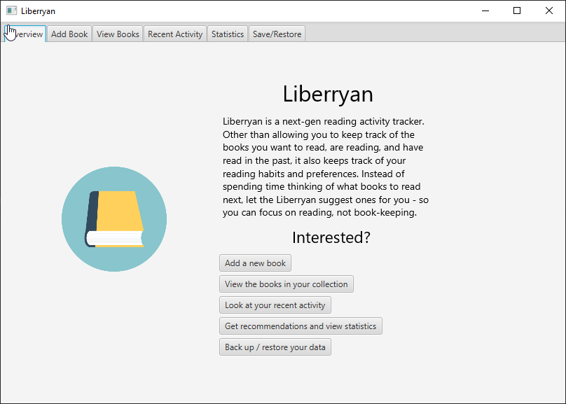
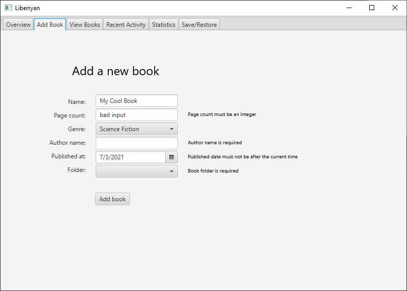
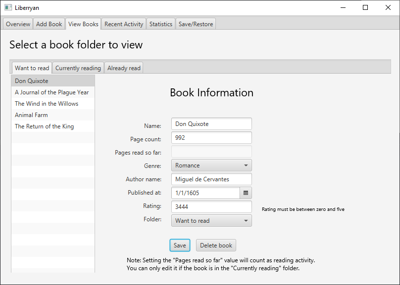
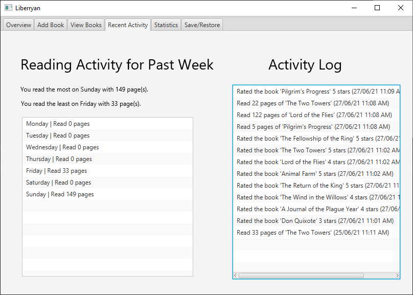
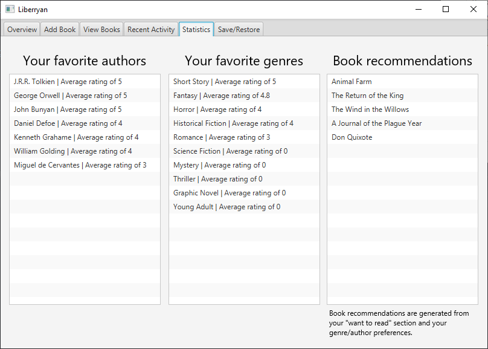
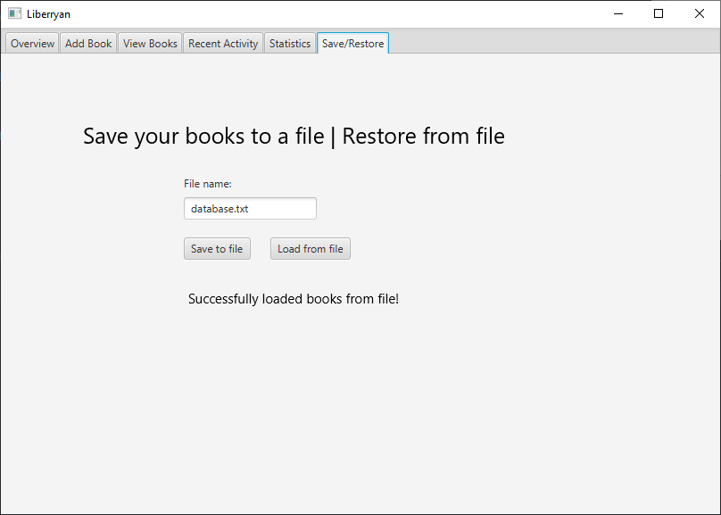

# Liberryan

> 📚 Let the Liberryan handle the menial tasks for you, so you can focus on reading, not book-keeping.

Liberryan is a JavaFX app that helps you track your reading activity.

## Installing

Go to [`src/liberryan/Main.java`](./src/liberryan/Main.java) and build. 
A sample database is included as [`database.txt`](./database.txt); you can load it by going to the "Save/restore data"
tab and using the filename `database.txt`.

The test suite is in [`./tests/`](./tests). 
The following functions are tested:

- `BookDatabase#removeBookFromList()`
- `BookDatabase#addBookToList()`
- `BookDatabase#getAllBooks()`
- `Book#getPagesReadBetween()`
- `Book#getTotalPagesRead()`: does some non-trivial computation, so it's tested
- `Book#getCurrentPage()`: see above
- `Book#setCurrentPage()`: does some non-trivial work, so it's tested
- `BookValidator.*`: every method is tested
- `ValidationErrorList.*`: every method is tested

## Features

- Keeps track of book information
- Allows categorizing books into three different folders (already read, currently reading, want to read)
- Supports rating books
- Tracks reading activity through remembering when you change the current page you're on for a book
- Displays recent activity cleanly
- Built-in statistics, shows your favorite authors & genres and attempts to recommend books from your "want to read" category based off that
- Supports saving your books & activity to a file

## Screenshots

**Welcome** 

**Add new book** 

**View books** 

**Reading activity** 

**Statistics** 

**Save/restore data** 
